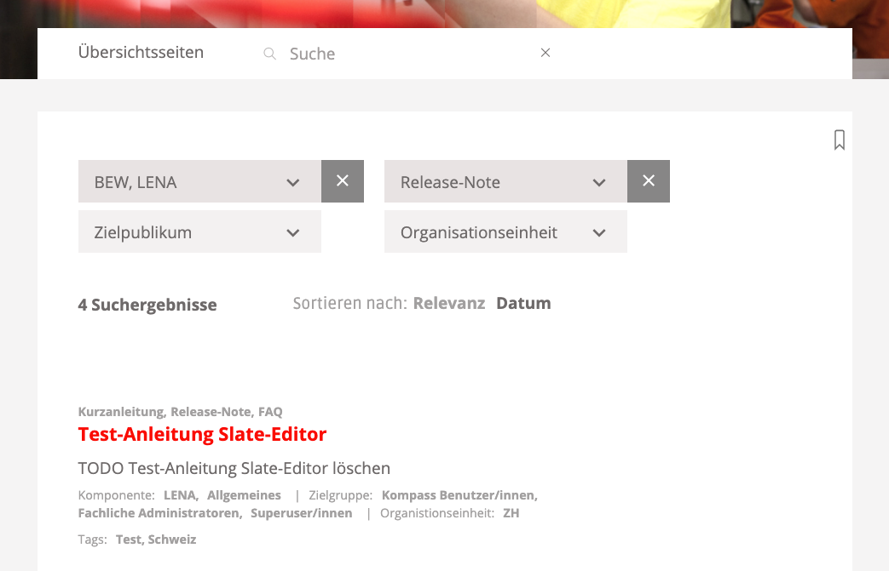
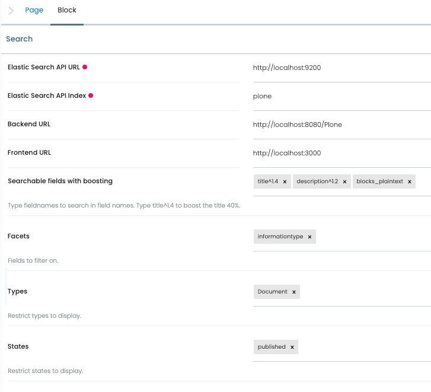

# @rohberg/volto-searchkit-block


## Features

### Find

Search block with highly overridable components for searching, filtering and displaying search results. Sometimes also called faceted navigation.

As this search is addressing `ElasticSearch` with text analysis, the search does understand inflection of words and tolerates typos by fuzzy searching.

Matched phrases are shown with highlighted matches.

Additional metadata per result item can be configured easily.
Meta data values are clickable to find related content.

The block is prepared for Matomo analytics.




## Getting started

You have ElasticSearch up and running with Plone. See [`collective.elastic.plone`](https://github.com/collective/collective.elastic.plone) and [`collective.elastic.ingest`](https://github.com/collective/collective.elastic.ingest) how to set up.

For searching in blocks content, install [`rohberg.elasticsearchblocks`](https://github.com/rohberg/rohberg.elasticsearchblocks) and enable its behavior on your content types.


## Configuration

The block is not for editors. So please enable adding a searchkit block once by

```js
config.blocks.blocksConfig.searchkitblock.restricted = true;
```

and disable the block after adding it to a page of your choice.

The block can be configured by 

- searchable fields with boosting
- facets
- restricting types and states
- results meta data




Enable Matomo tracking via

```js
  config.settings.searchkitblock.trackVoltoMatomo = true
```

## Overriding components

Components of @rohberg/volto-searchkit-block can be overridden via its overridableId:

```jsx
const MySearchkitResultsListItem = ({ result, index }) => {
  return (
    <div>
      <Header as="h3">
        <Link to={flattenESUrlToPath(result['@id'])}>
          {result.title}
        </Link>
      </Header>
    </div>
  );
};

config.settings.searchkitblock.overriddenComponents = {
  'ResultsList.item.elasticsearch': MySearchkitResultsListItem,
};
````


## Panel for testing matches

`/controlpanel/test-searchkit-querystrings`

Please update the settings according to your deployment: `/controlpanel/volto_searchkit_block_control_panel`


## User documentation

The search is a fuzzy search, that means typos are compensated. 
Approximate matches and inflections are found.

### Multiple search strings

Search results do include at least one of the search strings.

To force the match of a search string, precede it with "+".
To exclude matches of a search string, precede it with "-".

Use wildcards to find matches of words that complement the search string.

For exact matches of a search string embrace it with quotation marks.

A search for a word with hyphen is equivalent to a search for the word and the parts of it.  
Example: A search for "LSR-Lehrbetrieb" is equivalent to a search for "LSR-Lehrbetrieb LSR Lehrbetrieb"

Words with hyphen are matched by searches for part of the words.  
Example: "LSR-Lehrbetrieb" is found by a search for "LSR".


## Credits

This package is a Plone Volto integration of react-searchkit https://www.npmjs.com/package/react-searchkit Copyright (C) 2015-2019 CERN.


## Copyright and license

Copyright (C) 2022 Rohberg.

The project is licensed.
See [LICENSE](https://github.com/rohberg/volto-searchkit-block/blob/master/LICENSE) for details.
