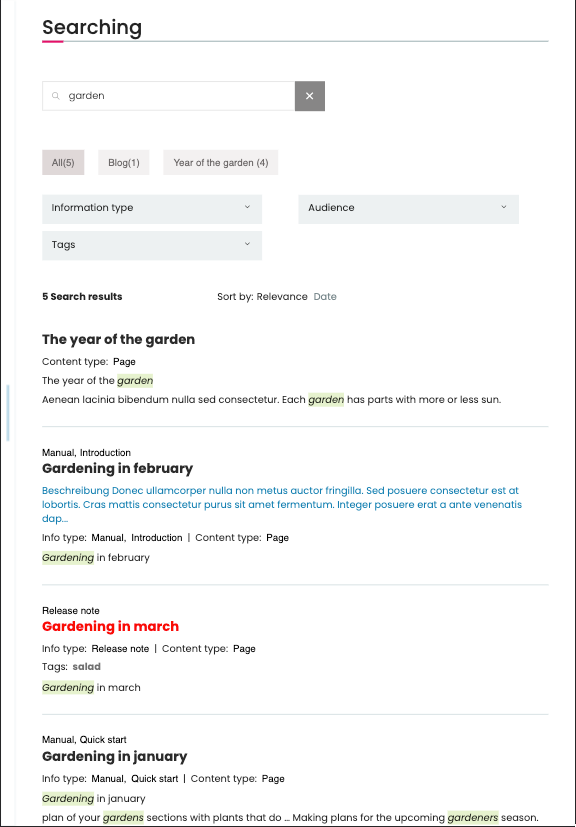
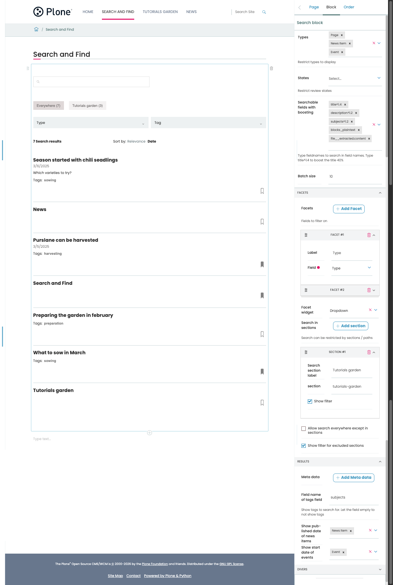

# Searching with OpenSearch or ElasticSearch

Volto block

The package provides a block for the Plone Volto frontend.

[](https://www.npmjs.com/package/@rohberg/volto-searchkit-block)
[](https://github.com/rohberg/volto-searchkit-block/actions/workflows/acceptance_multilingual.yml)
[](https://github.com/rohberg/volto-searchkit-block/actions/workflows/acceptance_monolingual.yml)
[](https://github.com/rohberg/volto-searchkit-block/actions/workflows/unit.yml)
[](https://github.com/rohberg/volto-searchkit-block/actions/workflows/code.yml)

## Features

Search block with highly overridable components for searching, filtering and displaying search results. Sometimes also called faceted navigation.

As this search is addressing `OpenSearch/ElasticSearch` with text analysis, the search does understand inflection of words, tolerates typos by fuzzy searching, allows exact search and wildcard search.
See [User documentation](#user-documentation) on how to search.

Matched phrases are shown with highlighted matches.

Additional metadata per result item can be configured easily.
Meta data values are clickable to find related content.

The block is prepared for Matomo analytics.




## User instructions

The search is a fuzzy search, that means typos are compensated.
Approximate matches and inflections are found.

To force the match of a search string, precede it with "+".
To exclude matches of a search string, precede it with "-".

Use wildcards to find matches of words that complement the search string.

For exact matches of a search string embrace it with quotation marks.

A search for a word with hyphen is equivalent to a search for the word and the parts of it.  
Example: A search for "LSR-Lehrbetrieb" is equivalent to a search for "LSR-Lehrbetrieb LSR Lehrbetrieb"

Words with hyphen are matched by searches for part of the words.  
Example: "LSR-Lehrbetrieb" is found by a search for "LSR".

### Multiple search strings

Search results include at least one of the search strings.


## Installation

Start with the index server OpenSearch/ElasticSearch.

### OpenSearch / ElasticSearch 

Copy `examples/opensearch/indexserver` to your project.

Add target `index-server-start` to your `Makefile`.

```Makefile
.PHONY: index-server-start
index-server-start: ## Start index server
	@echo "Start index server"
	$(MAKE) -C "./indexserver/" start
```

Start index server with `make index-server-start`.

`indexserver/opensearch-configuration` can be adjusted later when index server, backend and frontend is up and running and a search block searches and finds.  
See `docs/configuration_index_server` for the configuration of the handling of compound words.


### Plone backend

This add-on relies on indexing and secure querying via [collective.elastic.plone](https://github.com/collective/collective.elastic.plone).

Add this add-on `collective.elastic.plone` with appropriate parameters (`collective.elastic.plone[redis,opensearch]`) to your backend.
'Install' means: Available as Python package, loaded as Plone add-on (`instance.yaml`), installed as add-on (include as dependency in `metadata.xml`)

Add necessary environment variables to `devops/.env`.

```yaml
INDEX_LOGIN=admin
INDEX_PASSWORD=paraDiesli,17
PLONE_USER=admin
PLONE_PASSWORD=admin
```

For development we include in main `Makefile` an additional environment file `.env`

```Makefile
include .env
export
```

`.env`

```
INDEX_SERVER=localhost:9200
INDEX_USE_SSL=1
INDEX_OPENSEARCH=1
INDEX_LOGIN=admin
INDEX_PASSWORD=paraDiesli,17

CELERY_BROKER=redis://localhost:6379/0

PLONE_USER=admin
PLONE_PASSWORD=admin


```

You may want to change in /backend/Makefile:

```
# BACKEND_FOLDER=$(shell dirname $(realpath $(firstword $(MAKEFILE_LIST))))
BACKEND_FOLDER=$(dir $(realpath $(firstword $(MAKEFILE_LIST))))
```

And you may want to change in Makefiles with includes:

```
# @grep -E '^[a-zA-Z_-]+:.*?## .*$$' $(MAKEFILE_LIST) | sort | awk 'BEGIN {FS = ":.*?## "}; {printf "\033[36m%-30s\033[0m %s\n", $$1, $$2}'
	@grep -E '^[a-zA-Z_-]+:.*?## .*$$' $(MAKEFILE_LIST) | sort | awk 'BEGIN {FS = ":"}; {printf "\033[36m%-40s\033[0m %s\n", $$2, $$3}'
```

Run `make backend-install`.

Ignore the following error.
The indexing is done on first search.

```
ERROR:collective.elastic.plone:Reindexing of <PloneSite at Plone> failed.'
```

Github action `.github/workflows/backend.yml`:

```
env:
  INDEX_OPENSEARCH: 1
```


### Volto frontend

Add `volto-searchkit-block` to your `package.json`:

```json
"dependencies": {
    "@rohberg/volto-searchkit-block": "^1.0.0"
}
```

Add `@rohberg/volto-searchkit-block` to your add-ons in `volto.config.js`:

```javascript
const addons = ['@rohberg/volto-searchkit-block'];
```

### Configuration of the search block




### Tracking search with Matomo

The search can be tracked with an event listener.
The event dispatched per search is called `searchkitQueryChanged`.

#### Integration with `@eeacms/volto-matomo`

Event listener

```jsx
import React from 'react';
import * as matomoUtils from '@eeacms/volto-matomo/utils';

const TrackSearch = () => {
  React.useEffect(() => {
    const handleFooEvent = (event) => {
      // Matomo trackSiteSearch(keyword, [category], [resultsCount])
      // See https://developer.matomo.org/guides/tracking-javascript
      let options = {
        keyword: event.detail.queryString,
        category: 'search',
        count: event.detail.total,
      };
      matomoUtils.trackSiteSearch(
        options.keyword,
        options.category,
        options.count,
      );
    };

    window.addEventListener('searchkitQueryChanged', handleFooEvent);

    return () => {
      window.removeEventListener('searchkitQueryChanged', handleFooEvent);
    };
  }, []);

  return null;
};

export default TrackSearch;
```

Integrate via appExtra

```js
  config.settings.appExtras = [
    ...config.settings.appExtras,
    {
      match: '/',
      component: TrackSearch,
    },
  ];
```


### Panel for testing matches

You can test search results on a test panel: `/controlpanel/test-searchkit-querystrings`

Please update the settings according to your deployment: `/controlpanel/volto_searchkit_block_control_panel`


## Deployment

Assuming you have a project set up with cookieplone.

1. Add services ingest, redis, opensearch, and opensearch-dashboard to your devops compose file.

1. Provide environment values via .env file

    ```text
    ANSIBLE_REMOTE_PORT=22
    DEPLOY_ENV=prod
    DEPLOY_HOST=lilly.example.ch
    DEPLOY_PORT=22
    DEPLOY_USER=lillyuser
    DOCKER_CONFIG=.docker
    STACK_NAME=prod-lilly

    # Indexserver
    INDEX_PASSWORD=mypassword

    CELERY_LOGLEVEL=debug

    PLONE_USER=admin
    PLONE_PASSWORD=mypassword
    PLONE_SITE_PREFIX_PATH=Plone

    MAPPINGS_FILE=opensearch/ingest-configuration/mappings.json
    ANALYSIS_FILE=opensearch/ingest-configuration/analysis.json
    PREPROCESSINGS_FILE=opensearch/ingest-configuration/preprocessings.json
    ```

1. Provide configuration files.
Copy /examples/opensearch to /devops and customize.


## Development

The development of this add-on is done in isolation using a new approach using pnpm workspaces and latest `mrs-developer` and other Volto core improvements.
For this reason, it only works with pnpm and Volto 18.


### Pre-requisites

-   [Node.js](https://6.docs.plone.org/install/create-project.html#node-js)
-   [Make](https://6.docs.plone.org/install/create-project.html#make)
-   [Docker](https://6.docs.plone.org/install/create-project.html#docker)


### Make convenience commands

Run `make help` to list the available commands.

```text
help                                          Show this help
dev-backend-install                           Install Plone
dev-backend-start-monolingual                 Start Plone
dev-backend-start-multilingual                Start Plone
create-site-monolingual                       Create monolingual site
create-site-multilingual                      Create multilingual site
update-example-content-monolingual            Export monolingual example content to distribution
update-example-content-multilingual           Export multilingual example content to distribution
dev-index-start-monolingual                   Start index dev server monolingual
dev-index-start-multilingual                  Start index dev server multilingual
build-index-image                             Build the docker image for the index server
install                                       Installs the add-on in a development environment
start                                         Starts Volto, allowing reloading of the add-on during development
start-monolingual                             frontend with language 'de'
start-multilingual                            frontend with languages 'en' and 'de' and multilingual
build                                         Build a production bundle for distribution of the project with the add-on
i18n                                          Sync i18n
ci-i18n                                       Check if i18n is not synced
format                                        Format codebase
lint                                          Lint, or catch and remove problems, in code base
release                                       Release the add-on on npmjs.org
release-dry-run                               Dry-run the release of the add-on on npmjs.org
test                                          Run unit tests
ci-test                                       Run unit tests in CI
storybook-start                               Start Storybook server on port 6006
storybook-build                               Build Storybook
acceptance-frontend-dev-start-monolingual     Start acceptance frontend in development mode
acceptance-frontend-prod-start-monolingual    Start acceptance frontend in production mode
acceptance-backend-start-monolingual          Start backend acceptance server
ci-acceptance-backend-start-monolingual       Start backend acceptance server in headless mode for CI
acceptance-test-monolingual                   Start Cypress in interactive mode
ci-acceptance-test-monolingual                Run cypress tests in headless mode for CI
acceptance-frontend-dev-start-multilingual    Start acceptance frontend in development mode
acceptance-frontend-prod-start-multilingual   Start acceptance frontend in production mode
acceptance-backend-start-multilingual         Start backend acceptance server
ci-acceptance-backend-start-multilingual      Start backend acceptance server in headless mode for CI
acceptance-test-multilingual                  Start Cypress in interactive mode
ci-acceptance-test-multilingual               Run cypress tests in headless mode for CI
```

### Development environment set up

It's recommended to start three individual terminal sessions, one each for running the Plone backend, the Volto frontend, and the index server.
All sessions should start from the root directory.

Install backend.

```shell
make dev-backend-install
```

Install the frontend.

```shell
make install
```

### Start processes

Start the **index server**. Monolingual:

```shell
make dev-index-start-monolingual
```
or start the index server multilingual:

```shell
make dev-index-start-multilingual
```

Start the **backend**. Monolingual:

```shell
make dev-backend-start-monolingual
```

or start the multilingual backend:

```shell
make dev-backend-start-multilingual
```

Create a site with one of the two distributions, monolingual or multilingual.

```shell
make create-site-monolingual
```

or

```shell
make create-site-multilingual
```

In a separate terminal session, start the **frontend**:

```shell
make start-monolingual
```

or start multilingual:

```shell
make start-multilingual
```

### Lint code

Run ESlint, Prettier, and Stylelint in analyze mode.

```shell
make lint
```

### Format code

Run ESlint, Prettier, and Stylelint in fix mode.

```shell
make format
```

### i18n

Extract the i18n messages to locales.

```shell
make i18n
```

### Unit tests

Run unit tests.

```shell
make test
```

### Run Cypress tests

Run each of these steps in separate terminal sessions.

In the first session, start the frontend in development mode.

```shell
make acceptance-frontend-dev-start-monolingual
```

In the second session, start the backend acceptance server (backend and opensearch).

```shell
make acceptance-backend-start-monolingual
```

In the third session, start the Cypress interactive test runner.

```shell
make acceptance-test-monolingual
```

Appropriate make commands for **multilingual** Cypress tests are available.


## License

The project is licensed under the MIT license.

Copyright (C) 2026 Rohberg

## Credits and Acknowledgements 

This package uses UI components of react-searchkit https://www.npmjs.com/package/react-searchkit Copyright (C) 2015- CERN.
